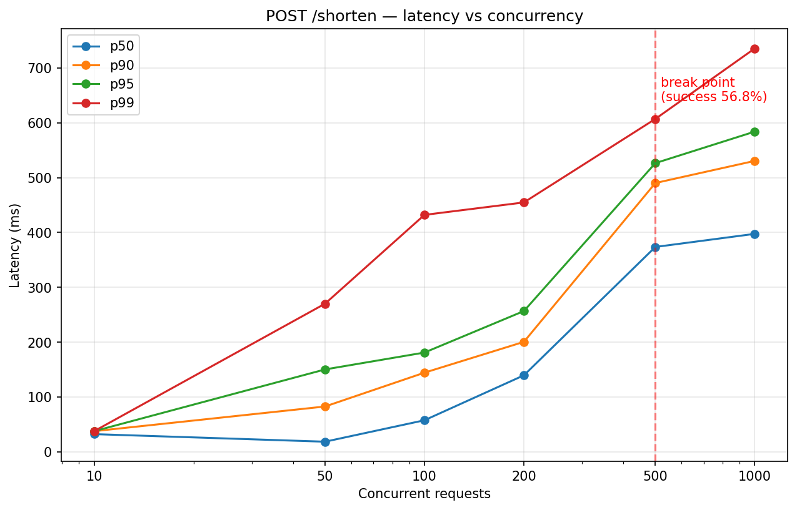
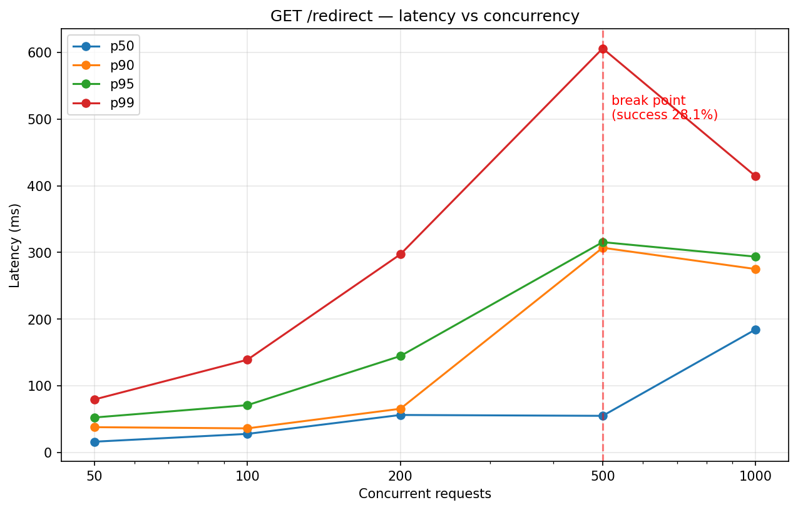

# URL Shortener

A simple URL shortener built with **Python, FastAPI, SQLModel, and SQLite**.

## Tech Stack

- **FastAPI** — web framework
- **SQLModel** — ORM (SQLAlchemy + Pydantic)
- **SQLite** — database, stored as `urls.db` in the repo (version-controlled)
- **Uvicorn** — ASGI server

## Project Structure

```
url-shortener/
├── app/
│   ├── main.py           # App entry point
│   ├── routers.py        # HTTP endpoints (thin layer)
│   ├── services.py       # Business logic (code generation, collision handling)
│   ├── repositories.py   # Database queries only
│   ├── models.py         # SQLModel table definitions
│   ├── schemas.py        # Pydantic request/response shapes
│   ├── database.py       # Engine, session, and DB init
│   └── utils.py          # Short-code generator
├── seed.py               # Seeds the database with 1M rows
├── urls.db               # SQLite database (committed)
├── requirements.txt
└── README.md
```

Layered architecture: **routers → services → repositories**. Each layer only talks to the one below it.

## Prerequisites

- Python 3.10+
- No database installation needed — SQLite is built into Python

## Run Locally

```bash
# 1. Clone the repository
git clone <repo-url>
cd url-shortener

# 2. Create and activate a virtual environment
python3 -m venv venv
source venv/bin/activate        # Windows: venv\Scripts\activate

# 3. Install dependencies
pip install -r requirements.txt

# 4. Start the server
python -m uvicorn app.main:app --reload
```

The API is now running at `http://127.0.0.1:8000`.

Interactive API docs (Swagger UI): **http://127.0.0.1:8000/docs**

## Run Tests

Tests use **pytest** with FastAPI's `TestClient` (no server needs to be running).

```bash
# From the project root, with the virtual environment activated
python -m pytest -v
```

## Test Results

| Endpoint        | p50      | p90      | p95      | p99      |
|-----------------|----------|----------|----------|----------|
| `POST /shorten` | 32.22 ms | 37.64 ms | 37.64 ms | 37.64 ms |
| `GET /redirect` | 22.88 ms | 24.02 ms | 24.02 ms | 24.02 ms |

## Load Testing — Finding the Break Point

### Results — POST /shorten

| Concurrency | p50      | p90       | p95       | p99       | Success % |
|-------------|----------|-----------|-----------|-----------|-----------|
| 10          | 32.2 ms  | 37.6 ms   | 37.6 ms   | 37.6 ms   | 100%      |
| 50          | 18.4 ms  | 82.6 ms   | 150.2 ms  | 270.1 ms  | 100%      |
| 100         | 57.5 ms  | 144.3 ms  | 181.0 ms  | 432.1 ms  | 100%      |
| 200         | 139.5 ms | 200.5 ms  | 256.7 ms  | 454.8 ms  | 100%      |
| 500         | 373.6 ms | 490.2 ms  | 526.5 ms  | 607.1 ms  | **56.8%** ❌ |
| 1000        | 397.5 ms | 530.6 ms  | 584.0 ms  | 735.7 ms  | **56.9%** ❌ |



### Results — GET /redirect

| Concurrency | p50      | p90       | p95       | p99       | Success % |
|-------------|----------|-----------|-----------|-----------|-----------|
| 50          | 16.0 ms  | 37.8 ms   | 52.3 ms   | 79.3 ms   | 100%      |
| 100         | 27.7 ms  | 36.0 ms   | 70.8 ms   | 138.9 ms  | 100%      |
| 200         | 56.1 ms  | 65.4 ms   | 144.5 ms  | 297.1 ms  | 100%      |
| 500         | 54.8 ms  | 307.0 ms  | 315.4 ms  | 606.0 ms  | **28.1%** ❌ |
| 1000        | 184.5 ms | 275.0 ms  | 293.6 ms  | 414.1 ms  | **23.3%** ❌ |




